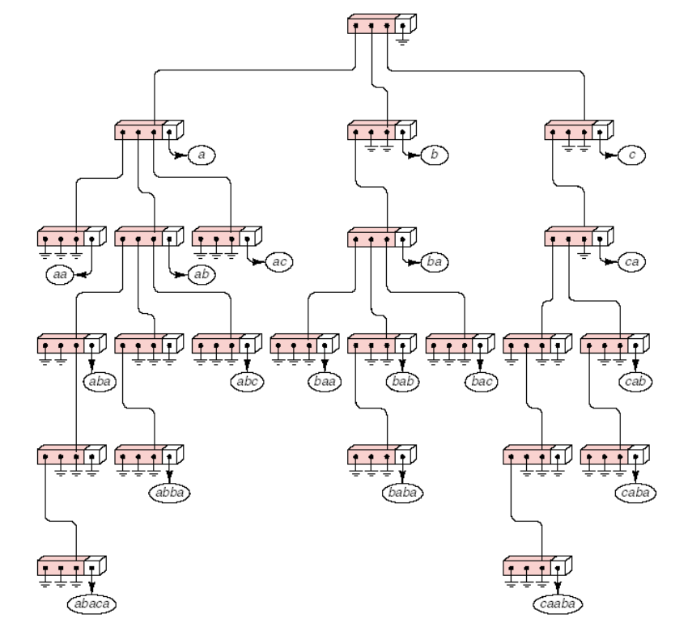
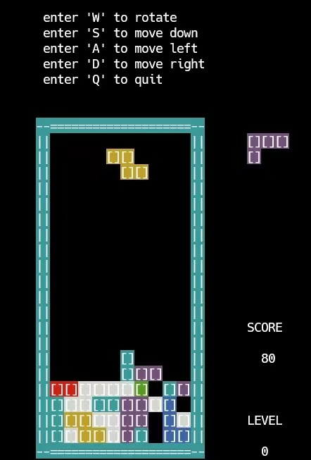

# weekly_work
This depository is used to store my weekly work code.
## week01
1. **uthash**, a library of data structures in C implemented with macros.
- Project address: https://github.com/troydhanson/uthash
- Document address: https://troydhanson.github.io/uthash/
I have recorded 8 videos explaining the use of the library uthash separately to facilitate subsequent development in C. The sample code is in the `uthash_data_structure` directory.
- uthash: 
https://www.bilibili.com/video/BV1EA4y1Q7WL?spm_id_from=333.999.0.0
https://www.bilibili.com/video/BV1Ua411a7vA?spm_id_from=333.999.0.0
https://www.bilibili.com/video/BV17S4y1h7XV?spm_id_from=333.999.0.0
- utlist: 
https://www.bilibili.com/video/BV1MB4y1y7Na?spm_id_from=333.999.0.0
- utstack
https://www.bilibili.com/video/BV17Y411c7Vc?spm_id_from=333.999.0.0
- utstring
https://www.bilibili.com/video/BV1g34y1h7Du?spm_id_from=333.999.0.0
- utarray
https://www.bilibili.com/video/BV1834y1h78H?spm_id_from=333.999.0.0
- utringbuffer
https://www.bilibili.com/video/BV1u34y1h7ah?spm_id_from=333.999.0.0
2. `uthash_data_structure/calculator` is a simple calculator implemented using utstack. It supports only integer operations, +, -, *, /, (, ).
3. `uthash_data_structure/ball_clock` is a solution to the [ball clock problem](https://code.jsoftware.com/wiki/Essays/The_Ball_Clock_Problem) using utstack and utlist. 
4. The tree-related code is in the `tree_data_structure` directory. `tree_data_structure/avl_tree` contains the creation and destruction of complete binary trees, insertion and deletion of binary sorted trees, recursive and non-recursive approaches to tree traversal in pre-order, mid-order, and post-order as well as hierarchical traversal, balancing of binary sorted trees, and deletion of balanced binary trees. `tree_data_structure/trie_tree` is an implementation of the trie tree in the following figure.

5. `tetris_game` is a C implementation of Tetris.

6. `Markdown_tutorial` is an introduction to the syntax of Markdown.
