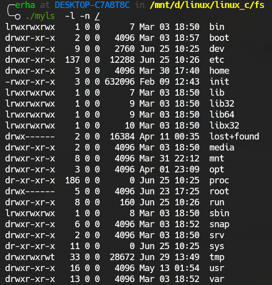
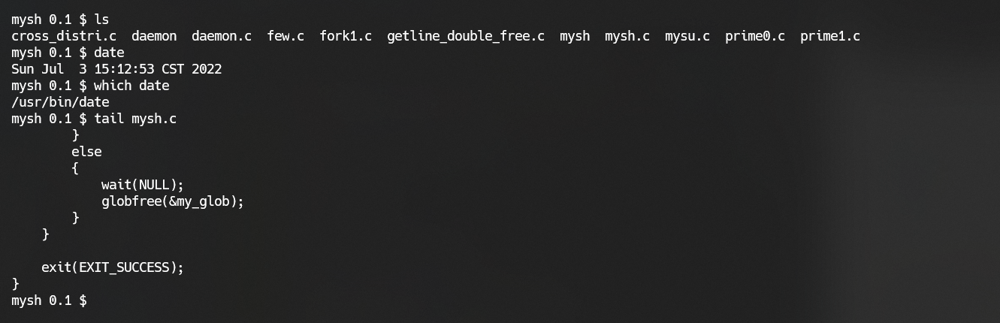
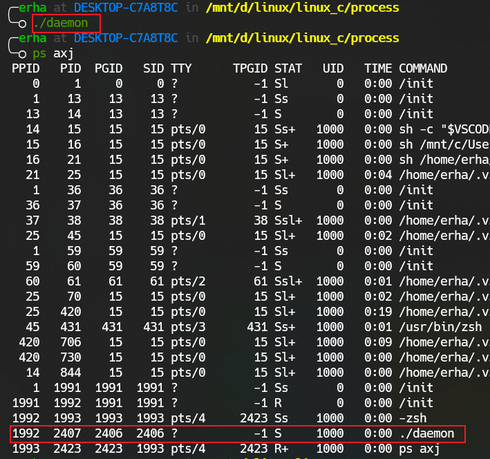
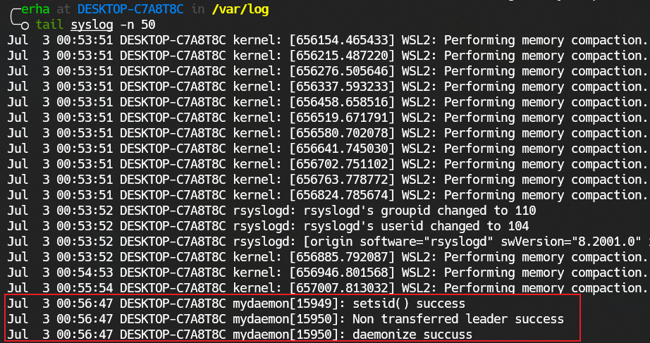

# weekly_work
This repository is used to store my weekly work code.
## week01
1. **uthash**, a library of data structures in C implemented with macros.
- Project address: https://github.com/troydhanson/uthash
- Document address: https://troydhanson.github.io/uthash/
I have recorded 8 videos explaining the use of the library uthash separately to facilitate subsequent development in C. The sample code is in the `uthash_data_structure` directory.
- uthash: 
https://www.bilibili.com/video/BV1EA4y1Q7WL?spm_id_from=333.999.0.0
https://www.bilibili.com/video/BV1Ua411a7vA?spm_id_from=333.999.0.0
https://www.bilibili.com/video/BV17S4y1h7XV?spm_id_from=333.999.0.0
- utlist: 
https://www.bilibili.com/video/BV1MB4y1y7Na?spm_id_from=333.999.0.0
- utstack
https://www.bilibili.com/video/BV17Y411c7Vc?spm_id_from=333.999.0.0
- utstring
https://www.bilibili.com/video/BV1g34y1h7Du?spm_id_from=333.999.0.0
- utarray
https://www.bilibili.com/video/BV1834y1h78H?spm_id_from=333.999.0.0
- utringbuffer
https://www.bilibili.com/video/BV1u34y1h7ah?spm_id_from=333.999.0.0
2. `uthash_data_structure/calculator` is a simple calculator implemented using utstack. It supports only integer operations, +, -, *, /, (, ).
3. `uthash_data_structure/ball_clock` is a solution to the [ball clock problem](https://code.jsoftware.com/wiki/Essays/The_Ball_Clock_Problem) using utstack and utlist. 
4. The tree-related code is in the `tree_data_structure` directory. `tree_data_structure/avl_tree` contains the creation and destruction of complete binary trees, insertion and deletion of binary sorted trees, recursive and non-recursive approaches to tree traversal in pre-order, mid-order, and post-order as well as hierarchical traversal, balancing of binary sorted trees, and deletion of balanced binary trees. `tree_data_structure/trie_tree` is an implementation of the trie tree in the following figure.

5. `tetris_game` is a C implementation of Tetris.

6. `Markdown_tutorial` is an introduction to the syntax of Markdown.

## week03
1. `stdio` is APIs for the standard IO and the system call IO.
2. `fs` is APIs for the file system.

## week04
1. Complete the file system section.
- Files and directories.
- System data files and information.
- Process environment.

The project in this section is to implement the `ls` command. I give the implementation in `week_04/fs/myls.c`.

2. Complete the process section.
- fork
- wait / waitpid
- exec family
- system
- shell
- real uid / effective uid
- real gid / effective gid
- session / process group
- foreground process / background process
- Daemon / Single-Instance Daemon
- openlog / syslog / closelog

The project in this section is to implement a toy **shell** and a **daemon** with the syslog part. I give the implementation in `week_04/process/mysh.c` and `week_04/process/daemon.c`.

## week05
1. Complete the signal section.
- kill
- raise
- pause
- alarm
- Leaky bucket model
- Token bucket model
- Multitask scheduler
- setitimer
- Signal set
- Signal frequency mask / sigprocmask
- sigsuspend
- sigaction
- Signal driver program
- Standard signal / Real time signal

The project in this section is to implement a multitask scheduler. I give the implementation in `week_05/signal/anytimer`. Later, it can be extended to multi-threaded concurrency framework.

2. Complete the multi-thread section.
- pthread_t / pthread_equal / pthead_self
- pthread_create
- pthread_exit
- pthread_cleanup_push / pthread_cleanup_pop
- pthread_cancel / pthread_setcancelstate / pthread_setcanceltype / pthread_testcancel 
- pthread_join / pthread_detach
- Multithreaded prime sieve method
- pthread_mutex_init / pthread_mutex_destroy / pthread_mutex_lock / pthread_mutex_unlock / pthread_mutex_trylock / PTHREAD_MUTEX_INITIALIZER
- mutex chain / sched_yield
- Multi-threaded version token bucket
- pthread_cond_t / pthread_cond_init / pthread_cond_signal / pthread_cond_broadcast / pthread_cond_wait / pthread_cond_timedwait / PTHREAD_COND_INITIALIZER
- Semaphore / Model of Reader-Writer (Prevent writer hunger)

The project in this section is to implement a multi-threaded version token bucket. I give the implementation used mutex in `week_05/thread/mytbf_thread/` and implementation used conditional variable in `week_05/thread/mytbf_cond/`.

## week06
1. Complete the Advanced IO section.
- Finite state machine
- Non-blocking IO
- Data relay
- IO multiplexing / select / poll / epoll
- readv / writev
- Memory mapping / mmap / munmap
- lockf
- Pipe for inter thread communication

The project in this section is to implement a **relay engine** using non-blocking IO and finite state machines and a **pipe** for inter thread communication. I give the implementation in `week_06/relayer/` and `week_06/pipe/`. 

2. Complete the Interprocess communication section.
- pipe / mkfifo
- Message Queues
- Semaphore Arrays
- Shared Memory Segments
- Byte order / Structure alignment / Type length unification
- hton / ntoh / inet_pton / inet_ntop
- UDP socket / bind / sendto / recvfrom / close
- UDP broadcast / multicast
- TCP socket / bind / listen / connect / accept / send / recv / close
- wireshark
- http download pictures